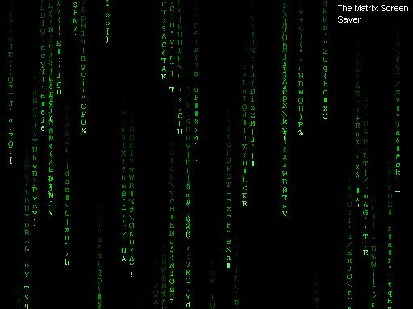



## A VB Screen Saver \(Matrix, Star Field, and Patterns\)

### Description

This is A Screen Saver program, A Little project I made when I was bored. It is a real .SCR file, that can be installed as your default screen saver!!
 
### More Info
 
In The command Line, If you Type /c following its filename, it will open settings. If you type /P the program will just end

             |
---                |---
**Submitted On**   |2004-05-04 22:14:02
**By**             |[Alex Murray](https://github.com/Planet-Source-Code/PSCIndex/blob/master/ByAuthor/alex-murray.md)
**Level**          |Intermediate
**User Rating**    |4.3 (17 globes from 4 users)
**Compatibility**  |VB 5\.0, VB 6\.0
**Category**       |[Miscellaneous](https://github.com/Planet-Source-Code/PSCIndex/blob/master/ByCategory/miscellaneous__1-1.md)
**World**          |[Visual Basic](https://github.com/Planet-Source-Code/PSCIndex/blob/master/ByWorld/visual-basic.md)
**Archive File**   |[VB\_Screen\_174145552004\.zip](https://github.com/Planet-Source-Code/alex-murray-a-vb-screen-saver-matrix-star-field-and-patterns__1-53574/archive/master.zip)

